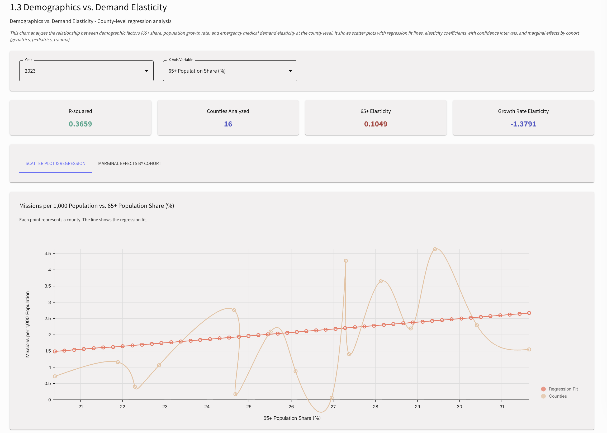
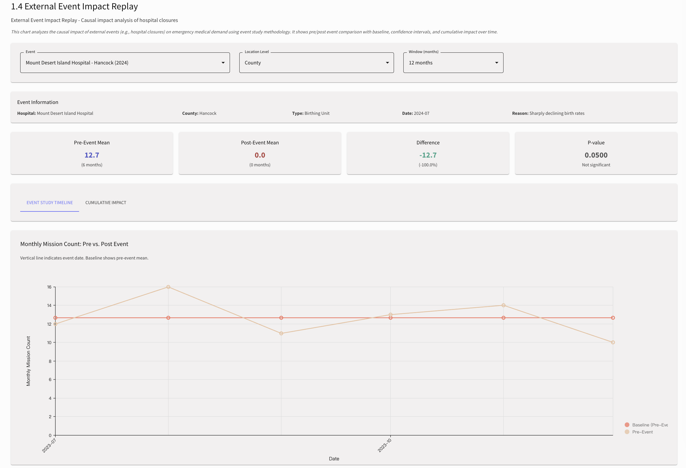
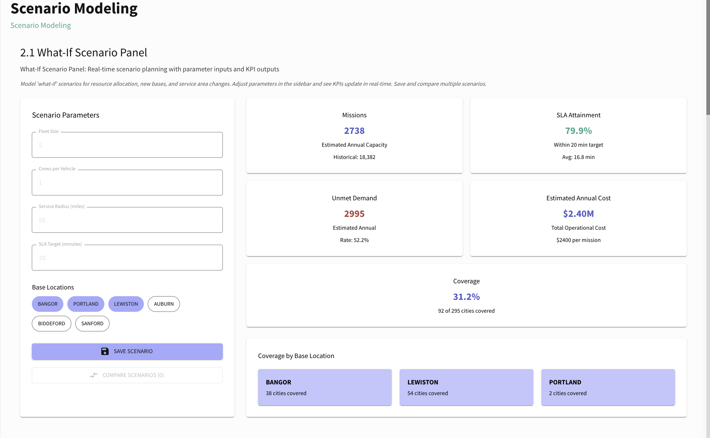
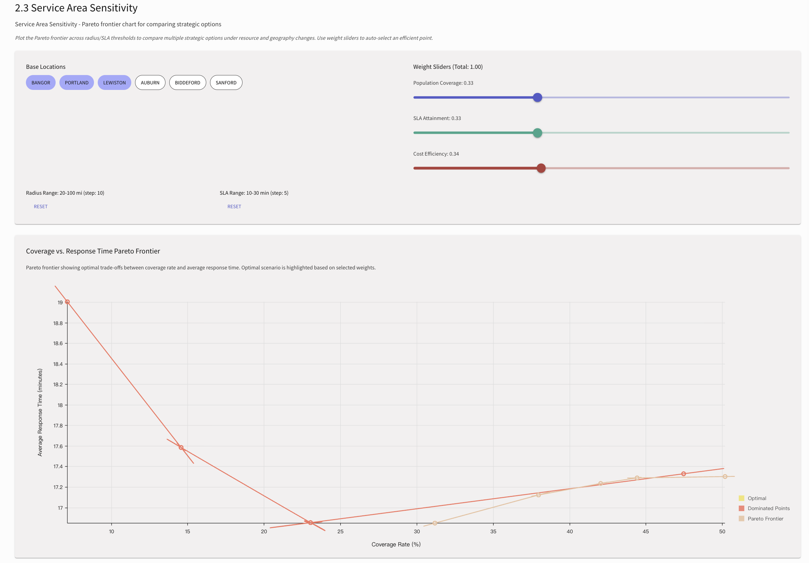
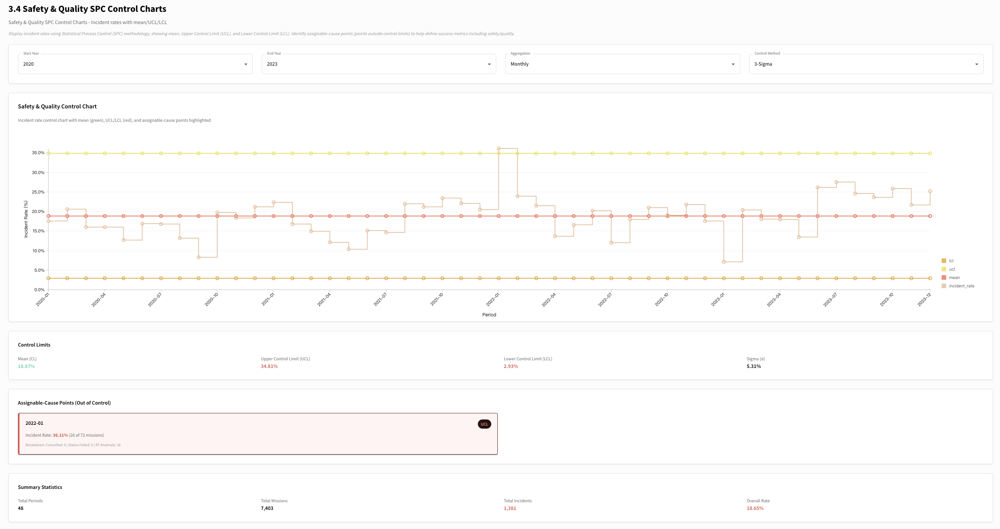

# Emergency Demand Intelligence Platform

A platform for emergency medical services that uses visual tools to provide demand forecasting, scenario modeling, and KPI dashboards. It helps optimize ambulance staffing and resources in Maine, long-term business planning, site selection, service demand growth, and future development.

## Overview

This project helps LifeFlight make strategic forecasts of emergency medical demand over the next 5–10 years and design the best resource allocation plans.
The platform brings together key external data, including population forecasts, historical and forecast weather data, and age demographics, to make demand predictions more accurate.

## Features

### Dashboard Overview


### 1. Demand Forecasting

#### 1.1 Long-term Demand Forecast - 5-10 year forecast with uncertainty bands


#### 1.2 Seasonality & Day-of-Week/Hour Heatmap - Temporal demand patterns


#### 1.3 Demographics vs. Demand Elasticity - Population age structure impact analysis


#### 1.4 External Event Impact Replay - Historical event analysis


### 2. Scenario Modeling

#### 2.1 What-If Scenario Panel - Interactive scenario comparison


#### 2.2 Base Siting Coverage Map - Geographic coverage analysis


#### 2.3 Service Area Sensitivity (Pareto Frontier) - Optimization trade-offs


#### 2.4 Weather-Driven Risk Boxes - Weather impact visualization


### 3. KPI & Executive Dashboard

#### 3.1 Core KPI Bullet Charts - Executive-ready KPI visualizations


#### 3.2 Trend Wall - Metric cards with YTD/YoY comparisons


#### 3.3 Cost–Benefit–Throughput Dual-Axis - Strategic planning metrics


#### 3.4 Safety & Quality SPC Control Charts - Quality control monitoring


## Tech Stack

### Backend
- **Python 3.12**
- **Flask** - Web framework
- **Pandas** - Data processing
- **Prophet** - Time series forecasting
- **LightGBM** - Machine learning
- **Folium** - Geographic visualizations

### Frontend
- **React 18**
- **Material-UI (MUI)** - UI components
- **Nivo** - Data visualization
- **React Router** - Navigation

## Project Structure

```
emergency-demand-intelligence-platform/
├── backend/
│   ├── app.py                 # Flask API server
│   ├── utils/                 # Utility modules
│   │   ├── getData.py         # Data loading utilities
│   │   ├── predicting/        # Forecasting models
│   │   └── ...                # Other utility modules
│   └── data/                  # Data files
├── lifeflight-dashboard-frontend/
│   ├── src/
│   │   ├── components/        # React components
│   │   ├── scenes/            # Page components
│   │   └── theme.js           # Theme configuration
│   └── package.json
└── README.md
```

## Data Sources

- LifeFlight operational data (transport volume, patient origin/destination, asset utilization)
- Population data (historical 2012–2023, projections 5–10 years)
- Population age structure data
- Historical weather data
- Weather forecast data

## Team

- **Shenyu Li** (Team Lead)
- **Yantong Guo**

## Repository

https://github.com/lishenyu1024/Emergency-Demand-Intelligence-Platform


